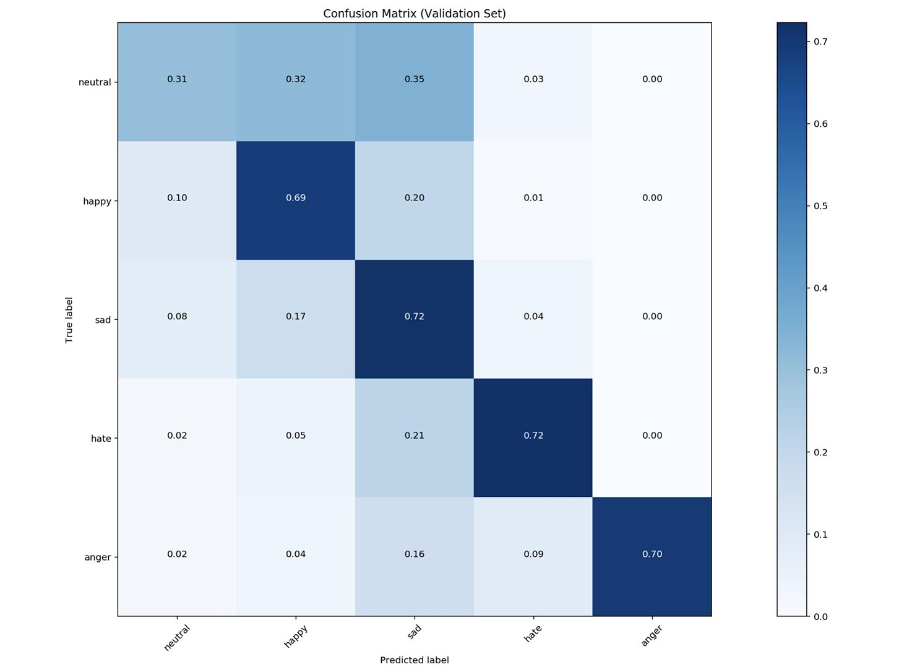
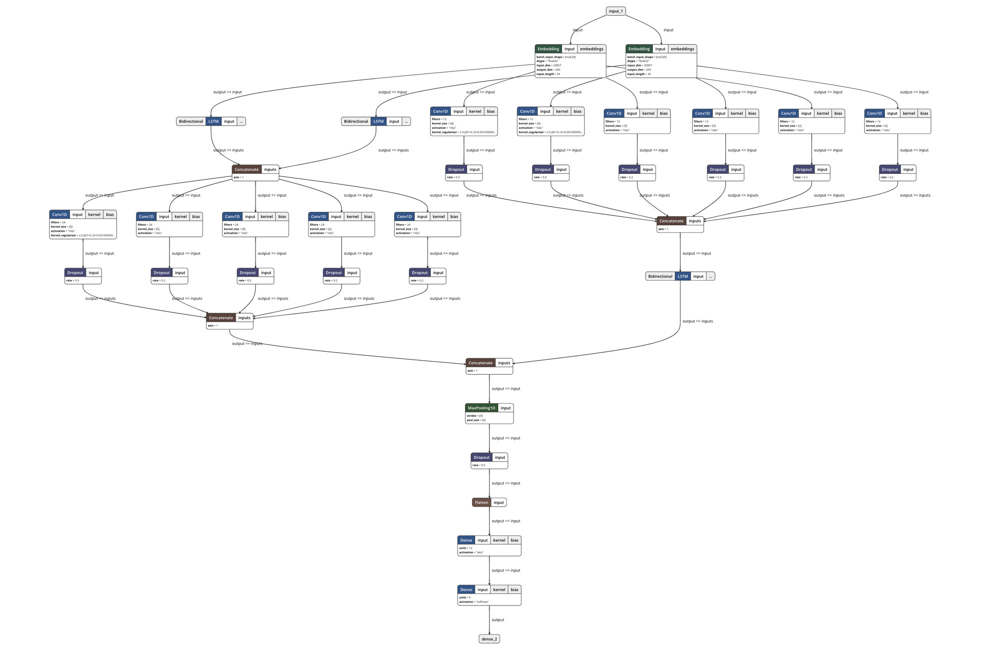

# Multi-class Emotion Classification for Short Texts

**Associating specific emotions to short sequences of texts**

We propose using "multi-channel" combinations of convolutional kernels (ala CNN) and Long Short-Term Memory (LSTM) units to classify short text sequences (in our case, tweets) into one of five emotional classes, as opposed to the typical binary (positive/negative) or ternary (positive/negative/neutral) classes.

Classifing short sequences of text into many classes is still a relatively uncommon topic of research. In particular, with the exception of Bouazizi and Ohtsuki (2017), few authors describe the effectiveness of classifing short text sequences (such as tweets) into anything more than 3 distinct classes (positive/negative/neutral). In particular, Bouazizi and Ohtsuki only achieved an overall accuracy of 56.9% or 60.2% on seven distinct classes in two of their papers. We hope to propose a new approach that can improve classification accuracy by a appreciable amount.

Our training and validation dataset is comprised of 47,288 tweets from Twitter with labelled emotions of five classes: **neutral**, **happy**, **sad**, **anger**, **hate**.

We have achieved a positive result by achieving more than **62%** overall classification accuracy and precision.

[Jupyter Notebook](https://github.com/tlkh/text-emotion-classification/blob/master/BalanceNet-1.0.ipynb): 62.29% peak validation accuracy, 0.62% overall precision.

In particular, we have achieved good validation accuracy on happy, sad, hate and anger (91% precision!) classes. Hate and anger were sometimes misclassified as sadness (occurs in Test data as well).

Compared to previous papers on this specific problem (Bouazizi and Ohtsuki, 2017), we fared worse in classifying neutral. Happiness is not a good comparison due to us merging two similar classes (fun and happy, or, love and happy) as compared to the original paper.

### Why are we doing this?

We are part of a team in SUTD that are working on a project to tackle the problem of Fake News. We want to prevent Singaporeans from falling victim to disinformation, hoaxes and Fake News. We are developing a system to indicate to readers (through a Chrome extension and a dedicated discussion forum) warning signs that indicate a particular article might be illegitimate. One of those warning signs are indications that people are reacting (through comments) to the news with either negative/wide spectrum of emotion, confusion, or offensive comments.

Hence, we are exploring how we can classify and label the comments on articles in a meaningful way.

## Methodology

We were inspired by previous work by other pioneers in the sentiment analysis and sentence classification field. Of note are the following:

- *Convolutional Neural Networks for Sentence Classification* (Yoo Kim, 2014)
- *Twitter Sentiment Analysis using combined LSTM-CNN Models* (Sosa, 2017)
- *A Pattern-Based Approach for Multi-Class Sentiment Analysis in Twitter* (Bouazizi and Ohtsuki, 2017)
- *Sentiment Analysis: from Binary to Multi-Class Classification* (Bouazizi and Ohtsuki, 2017)
- *Experimenting with Distant Supervision for Emotion Classification* (Purver and Battersby, 2012)

### Choice of Neural Network Model

**TLDR: why choose when you can have all?**

Long Answer: We play to the strengths of the various approaches.

RNNs, especially LSTMs, are preferred for many NLP tasks as it "learns" the significance of order of sequential data (such as texts or time-series data). On the other hand, CNNs extract features from data to identify them. Previous approaches either use one method (Yoo Kim, 2014) or take a hybrid approach by using both in the same model (Sosa, 2017). 

We take elements from each of the above models and extend the idea of creating multi-channel networks where we allow the model to *attempt* to self-learn which channels allow it to get better predictions for certain classes of data. Our hypothesis is this will allow the model to use the overall advantages of the different channels to make overall better predictions.

We call our prototype neural network **BalanceNet**.

### Multi-channel Approach

We omit having to make the following choices:

**Freezing the weights of the word embeddings from pre-trained GloVe vectors:**
Thus, We make a copy of the word embeddings and only allow the back-propagation to change the weights on one of two copies. This will hypothetically allow the model to both maintain generalised embeddings and learn more specific embeddings and use whichever is more suitable. This approach was proposed by Yoo Kim (2014).

**Choosing the CNN kernel size:**
We use multiple kernel sizes to allow features of different sizes to be extracted from input data. Again, this approach was proposed by Yoo Kim (2014). The kernel sizes we used are determine by [evaluating the individual performance](https://github.com/tlkh/text-emotion-classification/blob/master/experiments/LSTM-CNN%20Kernel%20Comparison.ipynb) of each kernel size.

**Choosing the order of which we pass the input sequence into the model (CNN to LSTM or LSTM to CNN):**
Sosa (2017) showed that a LSTM-CNN model works better than a CNN-LSTM, pure CNN or pure LSTM model. However, the differences in actual accuracy remain close, and differ according to the different classes. As our intention is to extract as many features as possible from our limited sequence, we use both approaches so we can take advantage of both **extract features from sequential output from the LSTM** (LSTM-CNN) and **extract features to be fed into LSTM** (CNN-LSTM).

We can concatenate all the channels and perform max-pooling. The last layer is a fully-connected layer which will then produce a prediction via a softmax activation function.

We introduce dropout and L2 regularisation at specific portions of the network (especially the higher kernel sizes) to reduce the possibility of over fitting the training data.

Also it actually looks like a mass balance.

## Dataset

### Original Dataset

The original dataset is comprised of 40,000 tweets classified into 13 emotion classes. However, previous authors have described that several of those classes were in fact extremely similar, and repeated efforts to re-label the data only result in 72% agreement. Hence, we make the decision to combine several of those classes into five final classes. These five classes are also the same as in Bouazizi and Ohtsuki (2017), with the absence of the "sarcasm" and "love" classes (*Binary to Multi-Class Classification*) or "fun" and "love" classes (*Pattern-Based Approach for Multi-Class Sentiment Analysis*). 

### Additional Data

We also pulled data from the Twitter using Twitter API as additional training data. The tweets are classified with their own hashtags - for example "#happy".

We feel that hashtags should be a appreciably good (but far from perfect) representation of the sentiment of the tweet. While it is conceiveable for someone to tweet something like "Uh, I got 90 for A levels #sad", this is a very small minority and can be taken to be statistical noise, which might have the added benefit of reduce over-fitting of training data.

### Is the data good/appropriate?

Being tweets, the text is short, informal, and spans a wide range of subjects. Hence, there is a good chance we will be able to use this dataset to create a baseline to classify short comments on other medium (such as on news websites) into the same classes of emotion. 

## Testing the model on "local" data

(Warning, some hateful online language ahead!!)

We tested our model on a variety of actual comments made on Reddit and Facebook by Singaporeans in "Singlish" and in our special, local blend of online slang.

Our results led us to two conclusions:

1. **Singlish** was a smaller challenge than previously expected. It is possible that some Singlish is captured in the GloVe vectors during training. In addition, it could be that the rest of the comment already provide the model sufficient hint to the emotion such that the unseen part (Singlish) is not crucial in classification.
2. **Sacarsm** was the major problem. Our model did not learn sarcasm, and thus misclassifies comments which are sarcastic. In a production setting, we propose using another seperate model to detect sarcasm, and to discard the results from this model should the other model detect a high level of sarcasm.
3. Many comments express multiple emotions. Hence, it might be worthwhile to consider multi-label classification to, for example, label a comment as both angry and sad.

In the future, we might also be also able to create a small dataset of **comments** with labelled emotions to further improve the accuracy of this model.

## Running the Code

1. Download pre-trained GloVe vectors from [Stanford NLP](https://nlp.stanford.edu/projects/glove/). We will be using the 200-dimensional embedding pre-trained on Twitter.
2. Place the GloVe vectors in /dataset/glove
3. Run one of the notebooks! (highlight: [BalanceNet 1.0](BalanceNet-1.0.ipynb))

General Requirements: Python 3, TensorFlow, Keras and NLTK

The model is actually light enough to be trained on a CPU. It was initially trained on my MacBook Pro.

## TODO

1. Improve pre-processing on Tweets to match the Stanford method

**Principal Investigator**: Timothy Liu

**Contributors**: Tong Hui Kang, Chia Yew Ken

**Institution**: Singapore University of Technology and Design (SUTD)